# From Black-Box to Explainability: Probabilistic Automata for Time Series Analysis

**Ders:** NaN
**Bölüm:** NaN
**Grup No:** NaN
**Öğrenci(ler):** NaN

---

## 1. Proje Özeti

Bu projede, çok değişkenli zaman serilerinde anomali tespiti problemi için iki farklı modelleme yaklaşımı karşılaştırılmıştır:

1. Derin öğrenme tabanlı black-box modeller:

   * Long Short-Term Memory (LSTM)
   * Gated Recurrent Unit (GRU)
   * One-Dimensional Convolutional Neural Network (1D-CNN)

2. Açıklanabilir sembolik model:

   * Piecewise Aggregate Approximation (PAA)
   * Symbolic Aggregate approXimation (SAX)
   * Olasılıksal Automata
   * Levenshtein distance tabanlı unseen pattern eşleme

Çalışmanın amacı yalnızca en yüksek performansı elde etmek değil; modellerin farklı veri setlerinde, gürültülü koşullarda ve daha önce gözlenmemiş örüntüler karşısındaki davranışlarını karşılaştırmalı ve açıklanabilir biçimde analiz etmektir.

---

## 2. Kullanılan Veri Setleri

### 2.1. SKAB

SKAB veri setinde yalnızca `valve1` ve `valve2` klasörlerindeki CSV dosyaları kullanılmıştır. Dosyalar birleştirilirken veri takibi ve leakage-safe bölme amacıyla aşağıdaki iki bilgi korunmuştur:

* `source_group`: Kaydın `valve1` veya `valve2` grubuna ait olduğunu belirtir.
* `source_file`: Kaydın geldiği özgün CSV dosyasını belirtir.

Model girdisinde yalnızca sensör değişkenleri kullanılmıştır. `datetime`, `changepoint`, `source_group` ve `source_file` alanları model girdisi olarak kullanılmamıştır.

| Özellik                       |     Değer |
| ----------------------------- | --------: |
| Kullanılan CSV dosyası sayısı |        20 |
| Toplam satır sayısı           |    22,472 |
| Anomali satırı sayısı         |     7,826 |
| Eksik değer sayısı            |         0 |
| Hedef değişken                | `anomaly` |

### 2.2. BATADAL

BATADAL için yalnızca **Training Dataset 2** kullanılmıştır. Zaman bilgisi model girdisine verilmemiş; kronolojik bölme ve sonuçların zamansal takibi için korunmuştur.

| Özellik              |      Değer |
| -------------------- | ---------: |
| Toplam satır sayısı  |      4,177 |
| Özellik sayısı       |         43 |
| Normal kayıt sayısı  |      3,958 |
| Anomali kayıt sayısı |        219 |
| Anomali oranı        |      %5.24 |
| Hedef değişken       | `ATT_FLAG` |

BATADAL veri setinin ciddi ölçüde dengesiz olması nedeniyle yalnızca accuracy metriğine dayanmak yanıltıcı olabilir. Bu nedenle Precision, Recall, F1-score, ROC-AUC ve Average Precision sonuçları birlikte değerlendirilmiştir.

---

## 3. Yazılım Mimarisi

Proje, merkezi konfigürasyon ve modüler pipeline yaklaşımıyla geliştirilmiştir.

```text
configs/
src/
├── data/
│   ├── data loading
│   ├── preprocessing
│   ├── splitting
│   └── windowing
├── models/
│   ├── lstm
│   ├── gru
│   ├── cnn1d
│   └── model factory
├── training/
│   ├── trainer
│   ├── early stopping
│   └── experiment runner
├── automata/
│   ├── PAA
│   ├── SAX
│   ├── probabilistic automata
│   ├── Levenshtein mapping
│   └── explainability
├── experiments/
│   ├── robustness scenarios
│   ├── batch orchestration
│   ├── controlled executor
│   └── artifact export
├── evaluation/
└── reporting/
tests/
reports/final/
```

### 3.1. Merkezi Konfigürasyon

Model hiperparametreleri, deney ayarları, random seed değerleri, split stratejileri, automata parametreleri, logging ve raporlama seçenekleri merkezi JSON konfigürasyon dosyalarında tutulmuştur. Böylece hard-coded deney akışı yerine parametrik bir yapı kurulmuştur.

### 3.2. Deney Takibi ve Çıktılar

Deneyler sonunda aşağıdaki çıktılar otomatik olarak üretilmiştir:

* CSV ve JSON performans kayıtları
* Örnek bazlı prediction çıktıları
* Automata açıklama kayıtları
* Transition matrix ve observed transition edge tabloları
* Confusion matrix, ROC/PR curve ve heatmap görselleri
* Sonuç özet tabloları
* Tekrar başlatılabilir checkpoint yapısı

---

## 4. Veri Ön İşleme ve Leakage Önleme

### 4.1. Derin Öğrenme Pipeline'ı

Derin öğrenme modellerinde:

1. Veri, veri setine uygun stratejiyle train/validation/test olarak ayrılmıştır.
2. Normalizasyon yalnızca train kümesi üzerinde fit edilmiştir.
3. Aynı dönüşüm validation ve test kümelerine uygulanmıştır.
4. Zaman serisi pencereleri, partition sınırlarını ve SKAB için dosya sınırlarını ihlal etmeyecek şekilde oluşturulmuştur.

### 4.2. Automata Pipeline'ı

Olasılıksal Automata yalnızca tek boyutlu girişle çalıştığı için:

1. Çok değişkenli sensör verileri train üzerinde fit edilen preprocessing ile dönüştürülmiştir.
2. PCA yalnızca train kümesi üzerinde fit edilmiştir.
3. İlk ana bileşen olan `PC1` kullanılmıştır.
4. Sliding context üzerinden PAA uygulanmıştır.
5. PAA değerleri SAX sembollerine dönüştürülmüştür.
6. Her sembolik kelime bir state olarak ele alınmıştır.
7. Transition probability değerleri yalnızca normal train örüntülerinden öğrenilmiştir.
8. Karar eşiği validation kümesi üzerinde belirlenmiştir.

Bu yapı, test bilgisinin eğitim veya sembolik sözlük üretimi sırasında kullanılmasını engellemiştir.

---

## 5. Deneysel Tasarım

### 5.1. Veri Bölme Stratejisi

| Veri Seti | Kullanılan Bölme Stratejisi                                                                                                                       |
| --------- | ------------------------------------------------------------------------------------------------------------------------------------------------- |
| SKAB      | `source_file` temelli grup ayrımı; aynı dosyanın train ve test içinde birlikte bulunması engellenmiştir. Sonuçlar fold bazlı değerlendirilmiştir. |
| BATADAL   | Zaman sırası korunarak `%60 train / %20 validation / %20 test` ayrımı yapılmıştır.                                                                |

### 5.2. Sabit Eğitim Parametreleri

| Parametre             |                         Değer |
| --------------------- | ----------------------------: |
| Epoch üst sınırı      |                            50 |
| Batch size            |                            32 |
| Early stopping        | Validation loss, patience = 5 |
| Random seed değerleri |         42, 123, 2026, 7, 999 |

Derin öğrenme modelleri beş farklı random seed ile değerlendirilmiştir. Probabilistic Automata pipeline'ı deterministik olduğundan, seed değişimi bu model için farklı stochastic eğitim çıktısı üretmemektedir. Bu nedenle Automata, BATADAL için tek deterministik koşum; SKAB için her fold üzerinde bir deterministik koşum olarak raporlanmıştır.

### 5.3. Değerlendirilen Senaryolar

| Senaryo        | Açıklama                                                                                                    |
| -------------- | ----------------------------------------------------------------------------------------------------------- |
| Original       | Temiz test verisi üzerindeki temel performans                                                               |
| Gaussian Noise | Test verisine train standart sapmasına göre `%1`, `%5` ve `%10` Gaussian noise eklenmesi                    |
| Unseen Pattern | Automata train sözlüğünde bulunmayan test örüntülerinin Levenshtein distance ile en yakın state'e eşlenmesi |

Gaussian noise deneyinde modeller yeniden eğitilmemiştir. Temiz train/validation üzerinde eğitilen model veya fit edilen Automata pipeline'ı, yalnızca gürültülü test verisi üzerinde tekrar değerlendirilmiştir.

---

## 6. Modeller

### 6.1. Derin Öğrenme Modelleri

Bu projede üç farklı deep learning modeli uygulanmıştır:

* **LSTM:** Uzun dönemli zamansal bağımlılıkları öğrenmek için kullanılmıştır.
* **GRU:** Daha sade kapı yapısıyla zamansal ilişkileri modellemek için kullanılmıştır.
* **1D-CNN:** Zaman pencereleri içindeki yerel örüntüleri convolution işlemleriyle yakalamak için kullanılmıştır.

### 6.2. Probabilistic Automata

Automata yaklaşımında çok değişkenli zaman serisi, PCA sonrası tek boyutlu `PC1` dizisine dönüştürülmüştür. Sliding context içindeki değerler PAA ve SAX aracılığıyla sembolik state dizilerine çevrilmiştir.

Bir geçişin olasılığı şu şekilde hesaplanır:

```text
P(Si → Sj) = observed_transition_count(Si → Sj) / total_outgoing_transition_count(Si)
```

Bir state yolunun olasılığı ardışık geçiş olasılıklarının birleşimine dayanır. Sayısal kararlılık ve anomali skorlama için pipeline içinde ortalama negatif log-olasılık temelli skor kullanılmıştır:

```text
Düşük olasılıklı yol → daha yüksek anomali skoru
Yüksek olasılıklı yol → daha normal davranış
```

---

## 7. Unseen Pattern Yönetimi ve Açıklanabilirlik

Test sırasında train sözlüğünde bulunmayan sembolik bir pattern görülürse, Levenshtein edit distance kullanılarak en yakın bilinen state belirlenir ve karar süreci bu eşlenen state üzerinden devam eder.

Açıklanabilirlik modülü her karar için aşağıdaki bilgileri üretir:

* Gözlemlenen state/pattern
* Pattern'ın seen veya unseen durumu
* Unseen ise eşlendiği bilinen state
* Levenshtein mesafesi
* Kullanılan transition dizisi
* Transition probability değerleri
* Yol/anomali skoru
* Karar eşiği
* Nihai anomaly/normal kararı
* Confidence bilgisi

Confidence değeri doğrudan sınıf olasılığı olarak değil, karar skoru ile kalibre edilmiş eşik arasındaki ilişkiyi açıklayan bir güven ifadesi olarak ele alınmıştır.

Gerçek koşumdan alınan örnek açıklama çıktısı:

* [`batadal_automata_explanation_example.json`](reports/final/examples/batadal_automata_explanation_example.json)

---

## 8. Temel Performans Sonuçları

Aşağıdaki tablo original senaryo sonuçlarını göstermektedir. Değerler ortalama ± standart sapma biçiminde verilmiştir.

### 8.1. SKAB Original Sonuçları

| Model    |        Accuracy |       Precision |              Recall |            F1-score |             ROC-AUC |   Average Precision |
| -------- | --------------: | --------------: | ------------------: | ------------------: | ------------------: | ------------------: |
| **GRU**  | 0.9172 ± 0.0351 | 0.9487 ± 0.0638 |     0.8204 ± 0.0921 | **0.8753 ± 0.0558** |     0.9326 ± 0.0419 |     0.9344 ± 0.0375 |
| LSTM     | 0.9103 ± 0.0488 | 0.9322 ± 0.0952 |     0.8241 ± 0.1021 |     0.8677 ± 0.0735 | **0.9352 ± 0.0354** | **0.9365 ± 0.0335** |
| 1D-CNN   | 0.8881 ± 0.0397 | 0.9020 ± 0.1015 |     0.7890 ± 0.0778 |     0.8355 ± 0.0533 |     0.9033 ± 0.0556 |     0.9074 ± 0.0490 |
| Automata | 0.3952 ± 0.0448 | 0.3646 ± 0.0083 | **0.9213 ± 0.1090** |     0.5211 ± 0.0191 |     0.4522 ± 0.0581 |     0.3503 ± 0.0221 |

SKAB üzerinde en yüksek F1-score değeri GRU tarafından elde edilmiştir. LSTM, ROC-AUC ve Average Precision açısından çok az daha yüksek değerler üretmiştir. Automata modeli yüksek recall sağlamış; ancak düşük precision nedeniyle fazla yanlış alarm üretmiştir.

### 8.2. BATADAL Original Sonuçları

| Model        |            Accuracy |       Precision |          Recall |        F1-score |             ROC-AUC |   Average Precision |
| ------------ | ------------------: | --------------: | --------------: | --------------: | ------------------: | ------------------: |
| **Automata** |              0.8271 |      **0.2389** |      **0.3375** |      **0.2798** |              0.6096 |              0.1500 |
| GRU          |     0.8889 ± 0.0241 | 0.0371 ± 0.0831 | 0.0325 ± 0.0727 | 0.0347 ± 0.0775 |     0.9328 ± 0.0575 |     0.5144 ± 0.2149 |
| 1D-CNN       |     0.8807 ± 0.0149 | 0.0000 ± 0.0000 | 0.0000 ± 0.0000 | 0.0000 ± 0.0000 |     0.1138 ± 0.0425 |     0.0556 ± 0.0022 |
| LSTM         | **0.8947 ± 0.0060** | 0.0000 ± 0.0000 | 0.0000 ± 0.0000 | 0.0000 ± 0.0000 | **0.9582 ± 0.0335** | **0.6111 ± 0.1750** |

BATADAL üzerinde accuracy değerleri tek başına yeterli değildir; veri seti yoğun biçimde dengesizdir. LSTM ve GRU yüksek ROC-AUC değerleriyle anomali skorlarını sıralama açısından güçlü görünse de kullanılan karar eşiğinde anomali sınıfını yeterli biçimde etiketleyememiştir. Bu nedenle mevcut karar eşiği altında en yüksek F1-score değeri Automata tarafından elde edilmiştir.

### 8.3. Genel Model Karşılaştırma Görseli

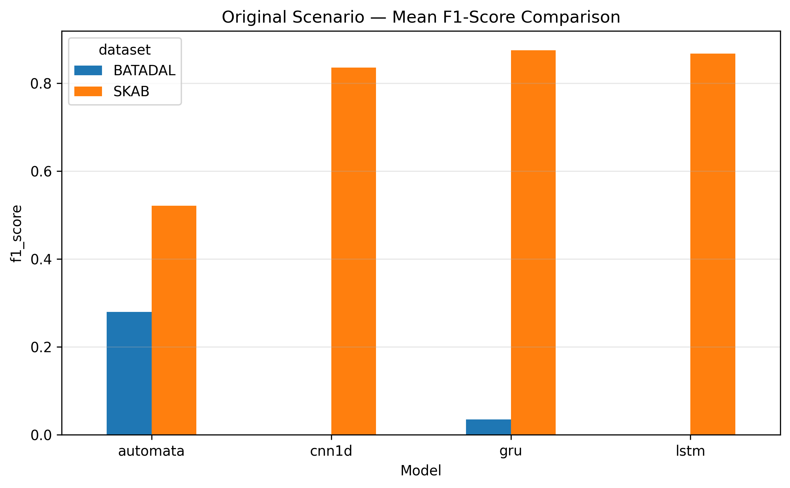

---

## 9. SKAB Fold Bazlı Sonuçlar

SKAB için sonuçlar `source_file` ayrımına dayalı fold yapısı üzerinde ayrıca incelenmiştir. Aşağıda F1-score ortalamaları verilmiştir.

| Model    | Fold 1 |     Fold 2 | Fold 3 |     Fold 4 | Fold 5 |
| -------- | -----: | ---------: | -----: | ---------: | -----: |
| GRU      | 0.8745 | **0.9354** | 0.8746 |     0.9049 | 0.7872 |
| LSTM     | 0.8604 |     0.9347 | 0.8579 | **0.9074** | 0.7781 |
| 1D-CNN   | 0.7870 |     0.8801 | 0.8456 |     0.8953 | 0.7693 |
| Automata | 0.4927 |     0.5144 | 0.5219 |     0.5348 | 0.5416 |

Detaylı fold tablosu:

* [`skab_fold_summary.csv`](reports/final/tables/skab_fold_summary.csv)

GRU ve LSTM fold'ların çoğunda güçlü ve birbirine yakın sonuçlar vermiştir. Fold 5'te derin öğrenme modellerinin performansında görülen düşüş, dosya bazlı ayrımın model genellenebilirliği üzerindeki etkisini göstermektedir.

---

## 10. Gürültü Dayanıklılığı Analizi

Gaussian noise yalnızca test verisine uygulanmış; modeller noise seviyeleri için yeniden eğitilmemiştir.

### 10.1. SKAB F1-score Sonuçları

| Model    |   Original | Noise %1 | Noise %5 |  Noise %10 | %10 Altındaki F1 Düşüşü |
| -------- | ---------: | -------: | -------: | ---------: | ----------------------: |
| GRU      | **0.8753** |   0.8750 |   0.8736 | **0.8711** |                  0.0042 |
| LSTM     |     0.8677 |   0.8675 |   0.8670 |     0.8665 |                  0.0013 |
| 1D-CNN   |     0.8355 |   0.8352 |   0.8347 |     0.8327 |                  0.0028 |
| Automata |     0.5211 |   0.5211 |   0.5211 |     0.5206 |                  0.0004 |

SKAB üzerinde tüm modeller Gaussian noise karşısında kararlı davranmıştır. Automata'nın mutlak performansı düşük olmakla birlikte F1 kaybı çok küçüktür. Derin öğrenme modelleri arasında en yüksek gürültülü performans GRU tarafından korunmuştur.

### 10.2. BATADAL F1-score Sonuçları

| Model    |   Original | Noise %1 | Noise %5 |  Noise %10 | %10 Altındaki F1 Değişimi |
| -------- | ---------: | -------: | -------: | ---------: | ------------------------: |
| Automata | **0.2798** |   0.2769 |   0.2741 | **0.2634** |                   -0.0164 |
| GRU      |     0.0347 |   0.0368 |   0.0368 |     0.0364 |                   +0.0017 |
| 1D-CNN   |     0.0000 |   0.0000 |   0.0000 |     0.0000 |                    0.0000 |
| LSTM     |     0.0000 |   0.0000 |   0.0000 |     0.0000 |                    0.0000 |

BATADAL üzerinde temel problem, noise etkisinden çok karar eşiği ve sınıf dengesizliği ile ilişkilidir. Deep learning modellerinin ROC-AUC değerleri yüksek olsa da F1-score sonuçları düşük kalmıştır.

Detaylı robustness tablosu:

* [`robustness_degradation_summary.csv`](reports/final/tables/robustness_degradation_summary.csv)

---

## 11. Unseen Pattern Analizi

Unseen pattern analizi Automata modeline uygulanmıştır. Bir test pattern'ı train sırasında oluşturulan SAX sözlüğünde yoksa unseen kabul edilmiş ve Levenshtein distance ile en yakın state'e eşlenmiştir.

| Veri Seti | Senaryo   | Ortalama Unseen Karar Oranı | Ortalama Unseen State Occurrence Oranı |
| --------- | --------- | --------------------------: | -------------------------------------: |
| BATADAL   | Original  |                      0.0137 |                                 0.0075 |
| BATADAL   | Noise %1  |                      0.0137 |                                 0.0075 |
| BATADAL   | Noise %5  |                      0.0137 |                                 0.0075 |
| BATADAL   | Noise %10 |                      0.0162 |                                 0.0087 |
| SKAB      | Original  |                      0.0000 |                                 0.0000 |
| SKAB      | Noise %1  |                      0.0000 |                                 0.0000 |
| SKAB      | Noise %5  |                      0.0000 |                                 0.0000 |
| SKAB      | Noise %10 |                      0.0000 |                                 0.0000 |

SKAB üzerinde test sırasında unseen state gözlenmemiştir. BATADAL üzerinde unseen karar oranı düşük olmakla birlikte mevcuttur ve en yüksek noise seviyesinde küçük bir artış göstermiştir.

Detaylı tablo:

* [`automata_unseen_summary.csv`](reports/final/tables/automata_unseen_summary.csv)

---

## 12. Automata Parametre Duyarlılık Analizi

Sabit karşılaştırma parametreleri:

```text
window size = 4
alphabet size = 3
```

Parametre analizi kapsamında aşağıdaki değerler test edilmiştir:

```text
window size ∈ {3, 4, 5, 6}
alphabet size ∈ {3, 4, 5, 6}
```

### 12.1. En İyi Parametre Kombinasyonları

| Veri Seti | Window Size | Alphabet Size |   F1-score | Ortalama State Sayısı | Ortalama Gözlenen Geçiş | Transition Density |
| --------- | ----------: | ------------: | ---------: | --------------------: | ----------------------: | -----------------: |
| BATADAL   |       **4** |         **3** | **0.2798** |                  77.0 |                   568.0 |             0.0958 |
| SKAB      |       **6** |         **4** | **0.5411** |                 194.8 |                  1096.2 |             0.0304 |

BATADAL üzerinde varsayılan parametre kombinasyonu aynı zamanda en yüksek F1-score değerini üretmiştir. SKAB üzerinde ise `window_size=6` ve `alphabet_size=4` kombinasyonu Automata performansını varsayılan ayarın üzerine çıkarmıştır.

### 12.2. Transition Density Tanımı

Geçiş yoğunluğu aşağıdaki şekilde hesaplanmıştır:

```text
transition_density =
    observed_directed_transition_count / (state_count × state_count)
```

State sayısı arttıkça olası geçiş uzayı karesel biçimde büyümektedir. Bu nedenle daha yüksek state sayısı otomatik olarak daha yoğun geçiş yapısı anlamına gelmez. Örneğin SKAB üzerindeki en iyi F1 kombinasyonu `window=6, alphabet=4` için transition density `0.0304` iken, daha küçük durum uzayına sahip `window=3, alphabet=4` kombinasyonunda density daha yüksek olabilmektedir.

### 12.3. Parametre Duyarlılık Görselleri

#### SKAB — F1-score Heatmap

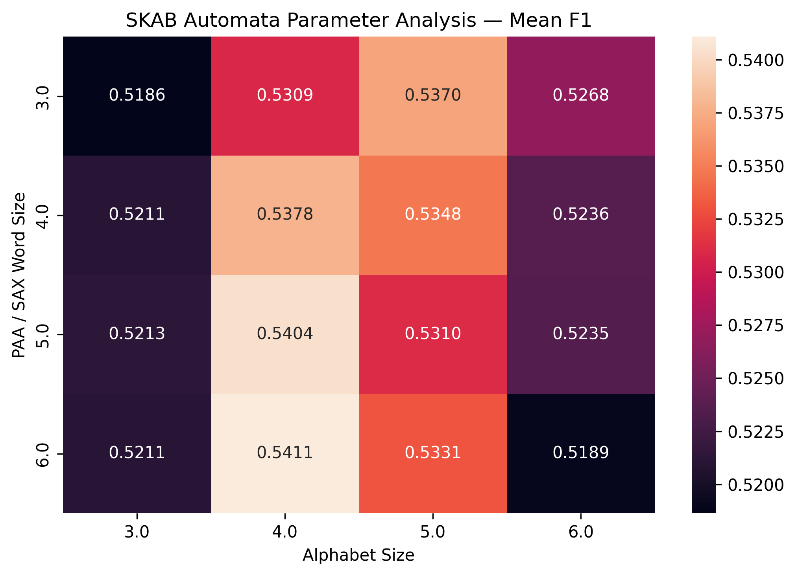

#### SKAB — Transition Density Heatmap

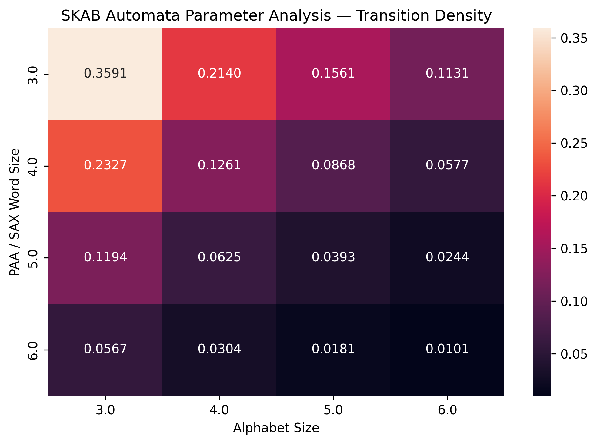

#### BATADAL — F1-score Heatmap

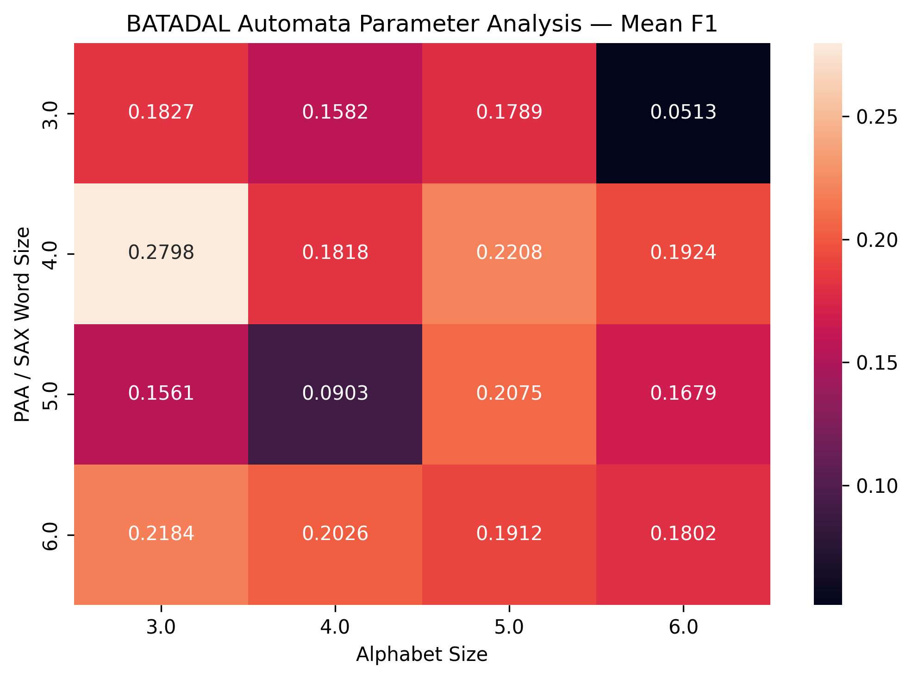

#### BATADAL — Transition Density Heatmap

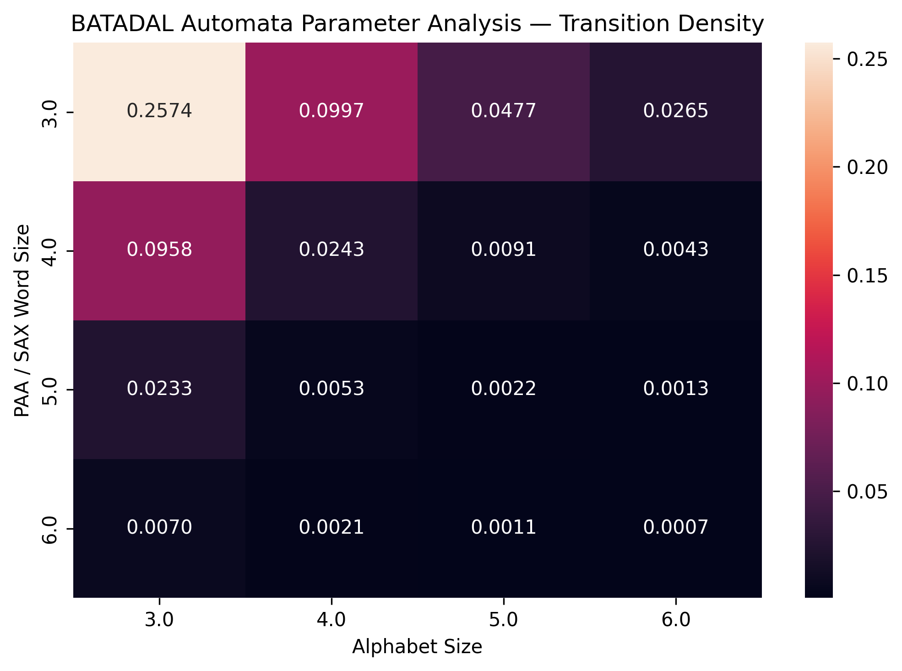

Detaylı parametre tablosu:

* [`automata_parameter_summary.csv`](reports/final/tables/automata_parameter_summary.csv)

---

## 13. İstatistiksel Anlamlılık Analizi

Deep learning modelleri, aynı fold/seed eşleşmeleri üzerinde çalıştırıldığı için original senaryo F1-score sonuçlarında **paired Wilcoxon signed-rank test** uygulanmıştır. Çoklu karşılaştırmalar için **Holm-Bonferroni düzeltmesi** kullanılmıştır.

Automata modeli deterministik olduğundan ve deep learning modelleriyle aynı seed-temelli tekrarlı örnekleme yapısını üretmediğinden, bu paired test tablosuna dahil edilmemiştir.

| Veri Seti | Karşılaştırma | Eşleşmiş Koşum Sayısı | Düzeltilmiş p-değeri | Sonuç                        |
| --------- | ------------- | --------------------: | -------------------: | ---------------------------- |
| BATADAL   | LSTM – GRU    |                     5 |             1.000000 | Anlamlı fark yok             |
| BATADAL   | LSTM – 1D-CNN |                     5 |             1.000000 | Anlamlı fark yok             |
| BATADAL   | GRU – 1D-CNN  |                     5 |             1.000000 | Anlamlı fark yok             |
| SKAB      | LSTM – GRU    |                    25 |             0.873988 | Anlamlı fark yok             |
| SKAB      | LSTM – 1D-CNN |                    25 |             0.001824 | **LSTM lehine anlamlı fark** |
| SKAB      | GRU – 1D-CNN  |                    25 |             0.000114 | **GRU lehine anlamlı fark**  |

SKAB üzerinde recurrent modellerin, 1D-CNN'e göre F1-score açısından anlamlı biçimde daha güçlü olduğu görülmüştür. GRU ve LSTM arasındaki fark anlamlı bulunmamıştır. BATADAL üzerinde ise modellerin F1-score farkları düzeltme sonrasında anlamlı değildir; bu durum veri setindeki yoğun sınıf dengesizliği ve threshold davranışıyla birlikte değerlendirilmelidir.

Detaylı istatistik tablosu:

* [`statistical_significance_summary.csv`](reports/final/tables/statistical_significance_summary.csv)

---

## 14. Görsel Analiz

### 14.1. SKAB — GRU Confusion Matrix

SKAB üzerinde en yüksek F1-score değerine sahip GRU modelinin confusion matrix çıktısı aşağıdadır.

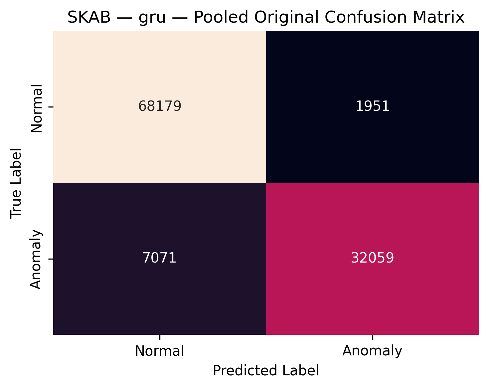

### 14.2. SKAB — GRU Precision-Recall Curve

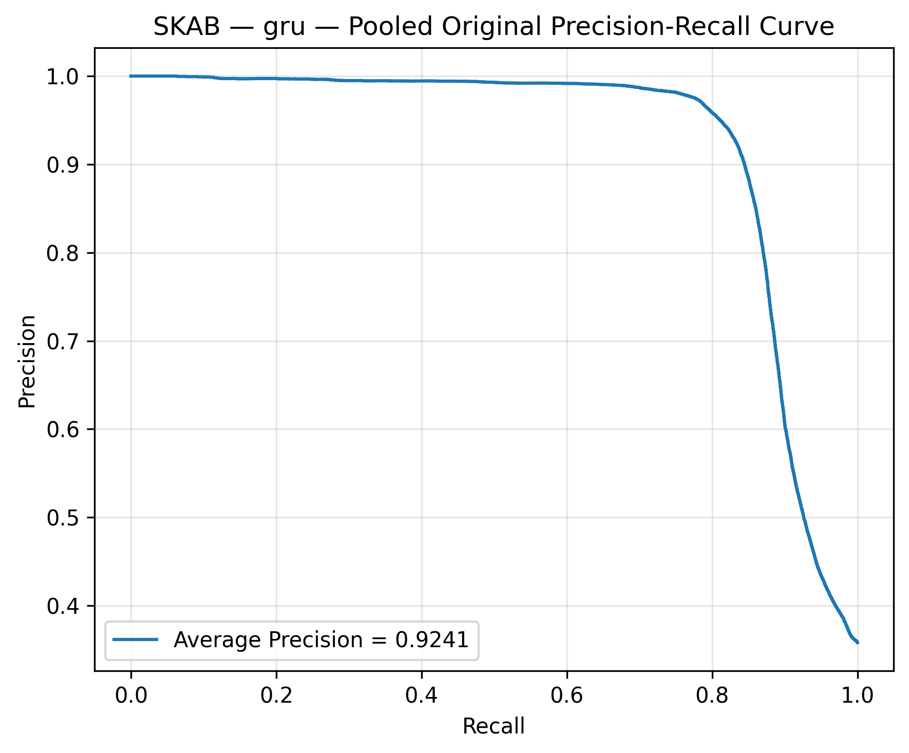

### 14.3. BATADAL — Automata Confusion Matrix

BATADAL üzerinde mevcut karar eşiğiyle en yüksek F1-score değerini Automata üretmiştir.

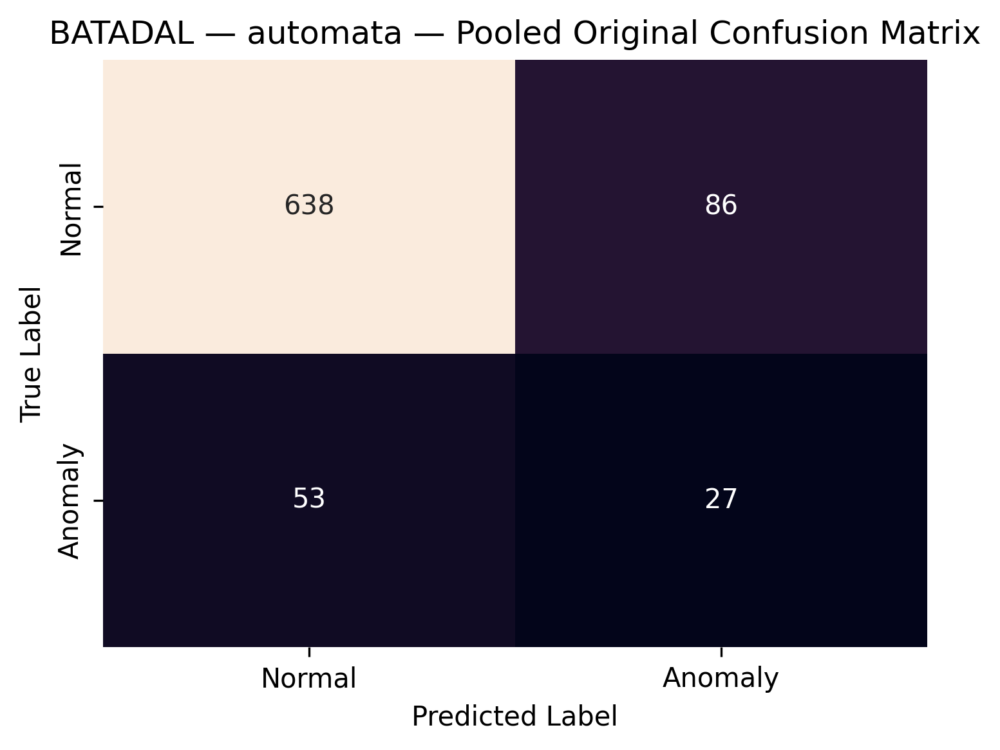

### 14.4. BATADAL — LSTM Precision-Recall Curve

LSTM'nin BATADAL üzerinde F1-score değeri sıfır olmasına rağmen yüksek ROC-AUC ve Average Precision üretmesi, skor sıralamasının güçlü; kullanılan sınıflandırma eşiğinin ise yetersiz olduğunu göstermektedir.

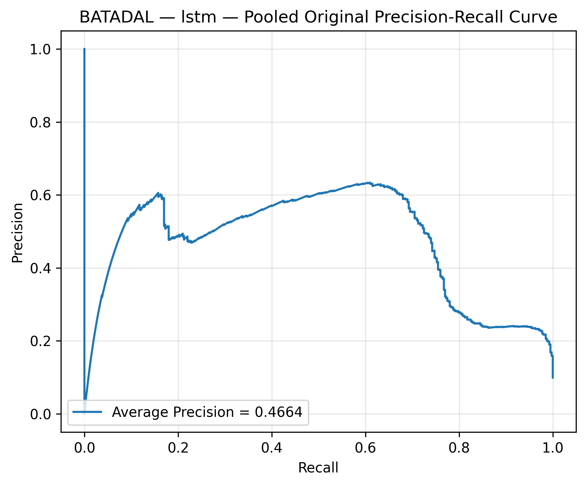

---

## 15. Automata State Diagram ve Transition Heatmap

### 15.1. SKAB Örneği

#### State Diagram

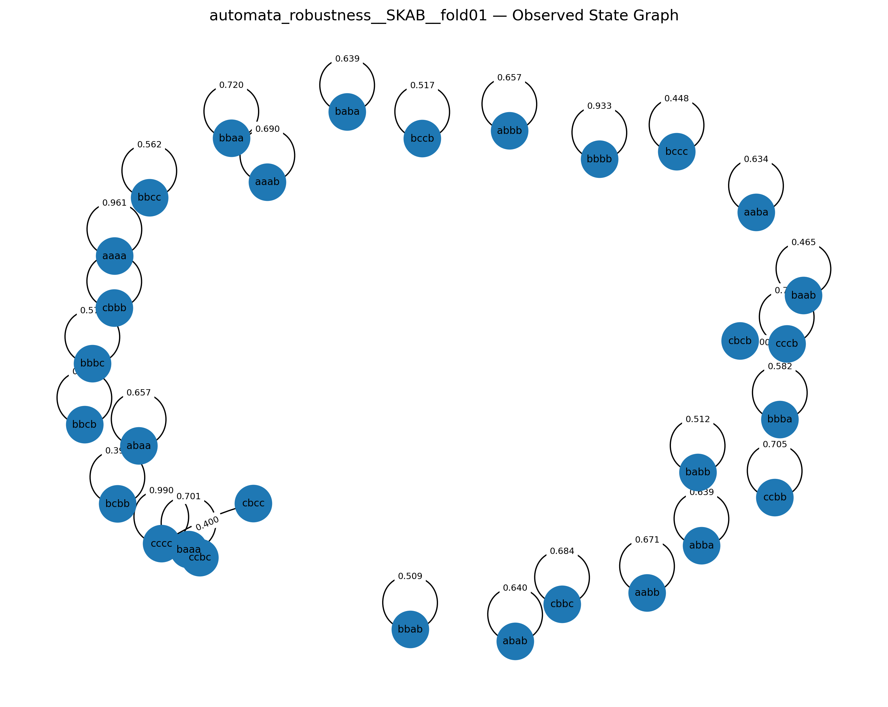

#### Transition Probability Heatmap

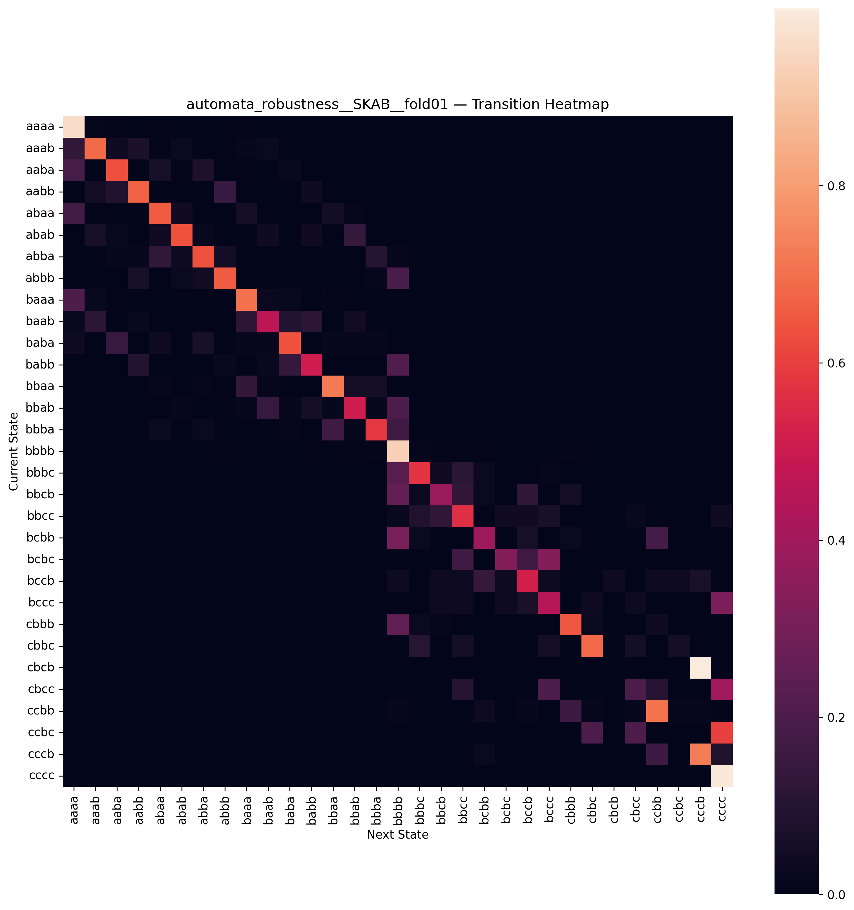

### 15.2. BATADAL Örneği

#### State Diagram

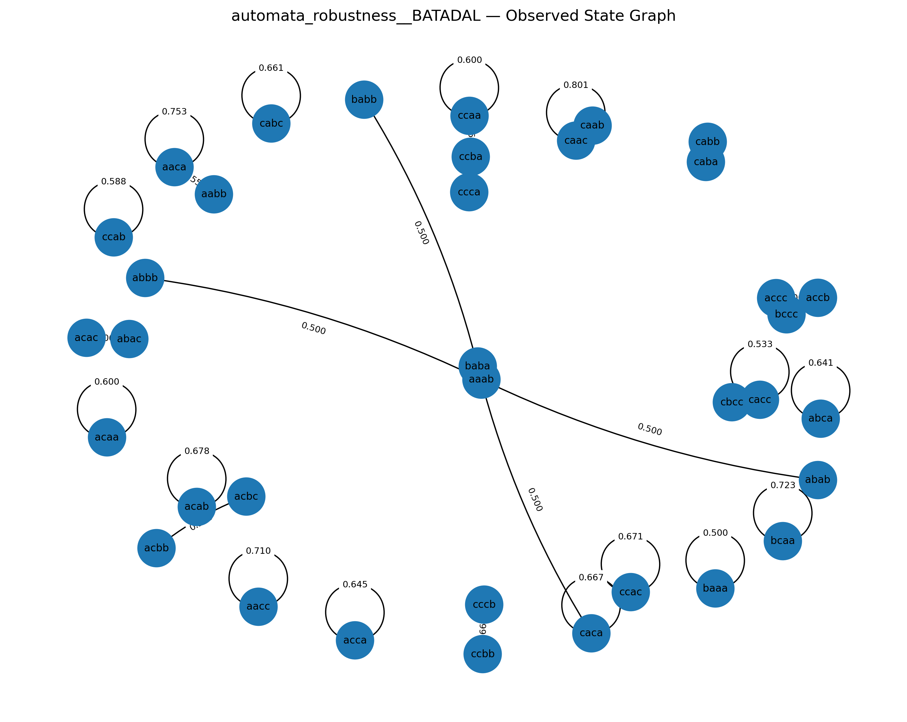

#### Transition Probability Heatmap

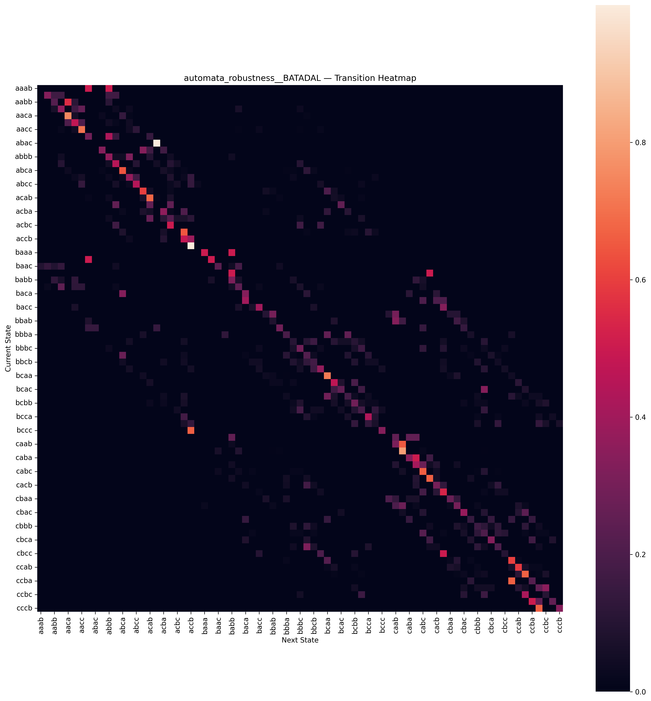

---

## 16. Runtime Karşılaştırması

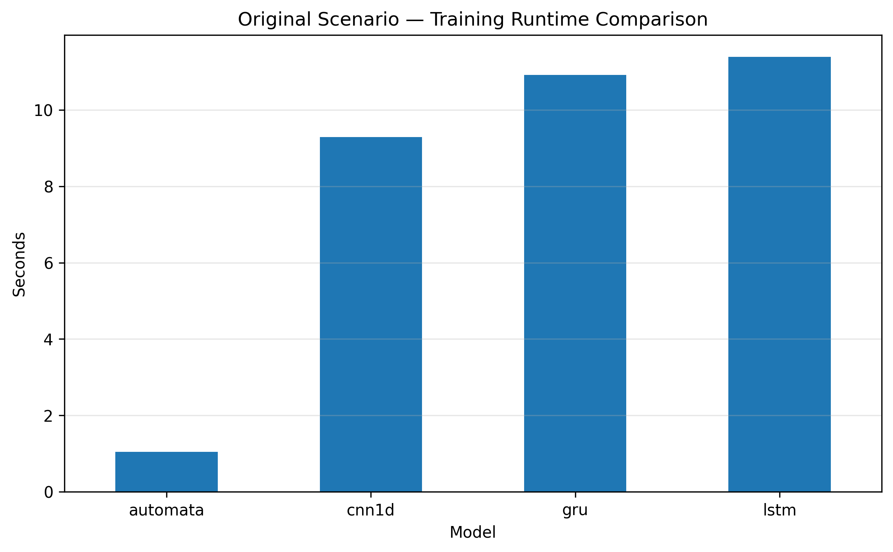

Runtime sonuçları, Automata modelinin eğitim/fit maliyetinin derin öğrenme modellerine göre düşük olduğunu göstermektedir. Buna karşılık SKAB üzerinde tahmin başarımı bakımından GRU ve LSTM belirgin biçimde üstündür. Bu durum, açıklanabilirlik ve doğruluk arasındaki uygulamaya bağlı dengeyi göstermektedir.

---

## 17. Genel Değerlendirme

Bu proje sonunda elde edilen temel bulgular şöyledir:

1. **SKAB üzerinde en güçlü genel model GRU olmuştur.**
   GRU, `0.8753 ± 0.0558` F1-score ile en yüksek sınıflandırma başarımını sağlamıştır. LSTM çok yakın performans gösterirken, recurrent modellerin 1D-CNN üzerindeki avantajı istatistiksel olarak desteklenmiştir.

2. **BATADAL üzerinde accuracy tek başına yanıltıcıdır.**
   LSTM yüksek ROC-AUC ve Average Precision değerlerine rağmen sabit karar eşiğinde anomaly sınıfını yakalayamamıştır. Mevcut threshold altında en yüksek F1-score Automata tarafından üretilmiştir.

3. **Gaussian noise, SKAB sonuçlarını ciddi biçimde bozmadı.**
   Noise `%10` seviyesine çıkarıldığında dahi GRU ve LSTM modellerinde F1 düşüşü sınırlı kalmıştır.

4. **Automata yorumlanabilirlik sağlar, ancak performans veri setine bağımlıdır.**
   Automata; state, transition, unseen mapping ve olasılık temelli karar açıklamalarını doğrudan sunmuştur. SKAB üzerinde deep learning modellerinin gerisinde kalırken, BATADAL üzerinde mevcut threshold koşulunda daha anlamlı F1-score üretmiştir.

5. **Parametre seçimi Automata davranışını değiştirmektedir.**
   BATADAL için varsayılan `window=4, alphabet=3` ayarı en iyi sonucu verirken, SKAB için `window=6, alphabet=4` daha yüksek F1-score sağlamıştır. State sayısı ve transition density analizi, sembolik temsil karmaşıklığının modele etkisini göstermiştir.

---

## 18. Yeniden Üretilebilirlik

Deney çıktıları aşağıdaki biçimde üretilmiştir:

* Merkezi konfigürasyon ile parametrik çalışma
* Random seed kayıtları
* CSV ve JSON experiment logging
* Checkpoint tabanlı tekrar başlatılabilir final execution
* Otomatik figure/report generation

Seçili final rapor çıktıları:

```text
reports/final/
├── examples/
│   └── batadal_automata_explanation_example.json
├── figures/
└── tables/
```

